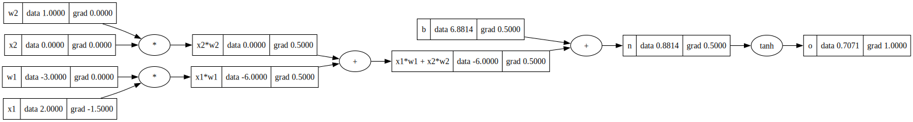
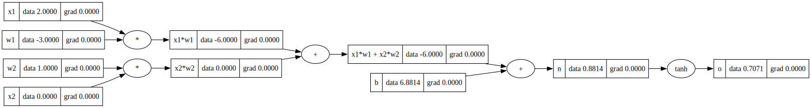
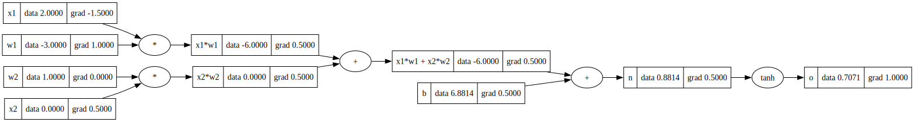

```python
from IPython.display import Image
```


```python
Image(filename = 'RENN.jpeg')
```


    

    


# Reverse Engineering a Neural Network

#### Inspired by Andrej Karpathy’s micrograd, this lecture builds a neural network from scratch, manually deriving gradients, automating backpropagation, and leveraging the TANH activation for nonlinearity. We bridge to PyTorch, demonstrating gradient descent’s power to minimize loss and reveal neural network fundamentals.

### [Original Video from Andrej Karpathy](https://youtu.be/VMj-3S1tku0?si=-Tzz2Y2-iv5FLDtY)

#### Credit: [Andrej Karpathy](mailto:karpathy@eurekalabs.ai)
#### Instructor: [Kevin Thomas](mailto:ket189@pitt.edu)

## Imports


```python
import math
import random
import numpy as np
import matplotlib.pyplot as plt
%matplotlib inline
```

## Foundational Classes & Functions


```python
class Value:
    """
    A class representing a scalar value in a computational graph.

    This class supports operations such as addition, subtraction, multiplication, 
    division, exponentiation, and hyperbolic tangent (tanh), along with automatic 
    differentiation through backpropagation. It is designed to build and manipulate 
    computational graphs for neural network computations.
    
    Attributes:
        data (float): The scalar value this object holds.
        grad (float): The gradient of this value with respect to some scalar loss.
        _backward (function): A function to compute the local gradient contribution during backpropagation.
        _prev (set[Value]): The set of `Value` objects that are inputs to this value.
        _op (str): The operation that produced this value (e.g., '+', '*', 'tanh', '**').
        label (str): A label for identifying the value (useful for visualization and debugging).
    """

    def __init__(self, data, _children=(), _op='', label=''):
        """
        Initializes a `Value` object.

        Args:
            data (float): The scalar value to store.
            _children (tuple[Value], optional): The `Value` objects used to produce this value. Default is an empty tuple.
            _op (str, optional): The operation that produced this value. Default is an empty string.
            label (str, optional): A label for this value. Default is an empty string.
        """
        self.data = data
        self.grad = 0.0
        self._backward = lambda: None
        self._prev = set(_children)
        self._op = _op
        self.label = label

    def __repr__(self):
        """
        Returns a string representation of the `Value` object.

        Returns:
            str: A string showing the data value.
        """
        return f'Value(data={self.data})'
    
    def __add__(self, other):
        """
        Defines the addition operation for `Value` objects.

        Args:
            other (Value): The other `Value` object to add.

        Returns:
            Value: A new `Value` object representing the sum of the two values.

        Note:
            The `_backward` method for the resulting value calculates the gradient contributions
            to both operands of the addition.
        """
        other = other if isinstance(other, Value) else Value(other)
        out = Value(self.data + other.data, (self, other), '+')
        
        def _backward():
            self.grad += 1.0 * out.grad
            other.grad += 1.0 * out.grad
        out._backward = _backward
        
        return out

    def __mul__(self, other):
        """
        Defines the multiplication operation for `Value` objects.

        Args:
            other (Value): The other `Value` object to multiply.

        Returns:
            Value: A new `Value` object representing the product of the two values.

        Note:
            The `_backward` method for the resulting value calculates the gradient contributions
            to both operands of the multiplication.
        """
        other = other if isinstance(other, Value) else Value(other)
        out = Value(self.data * other.data, (self, other), '*')
        
        def _backward():
            self.grad += other.data * out.grad
            other.grad += self.data * out.grad
        out._backward = _backward
        
        return out

    def __pow__(self, other):
        """
        Defines the power operation for `Value` objects.

        Args:
            other (int or float): The exponent to which the value is raised.

        Returns:
            Value: A new `Value` object representing the value raised to the power of `other`.

        Note:
            The `_backward` method for the resulting value calculates the gradient contribution
            for the power operation.
        """
        assert isinstance(other, (int, float)), 'only supporting int/float powers for now'
        out = Value(self.data**other, (self,), f'**{other}')
        
        def _backward():
            self.grad += other * (self.data ** (other - 1)) * out.grad
        out._backward = _backward
        
        return out

    def __rmul__(self, other):
        """
        Defines right-side multiplication for `Value` objects.

        Args:
            other (float or Value): The value to multiply from the right.

        Returns:
            Value: A new `Value` object representing the product.
        """
        return self * other

    def __truediv__(self, other):
        """
        Defines division operation for `Value` objects.

        Args:
            other (Value): The divisor `Value` object.

        Returns:
            Value: A new `Value` object representing the division.

        Note:
            This is implemented as multiplying by the reciprocal.
        """
        return self * other**-1

    def __neg__(self):
        """
        Defines the negation operation for a `Value` object.

        Returns:
            Value: A new `Value` object representing the negated value.
        """
        return self * -1

    def __sub__(self, other):
        """
        Defines the subtraction operation for `Value` objects.

        Args:
            other (Value): The other `Value` object to subtract.

        Returns:
            Value: A new `Value` object representing the difference.
        """
        return self + (-other)

    def __radd__(self, other):
        """
        Defines right-side addition for `Value` objects.

        Args:
            other (float or Value): The value to add from the right.

        Returns:
            Value: A new `Value` object representing the sum.
        """
        return self + other

    def tanh(self):
        """
        Applies the hyperbolic tangent (tanh) function to the value.

        Returns:
            Value: A new `Value` object representing the tanh of this value.

        Note:
            The `_backward` method for the resulting value calculates the gradient contribution
            for the tanh function: `(1 - tanh(x)^2)`.
        """
        x = self.data
        t = (math.exp(2*x) - 1) / (math.exp(2*x) + 1)
        out = Value(t, (self,), 'tanh')
        
        def _backward():
            self.grad += (1 - t**2) * out.grad
        out._backward = _backward
        
        return out

    def exp(self):
        """
        Applies the exponential function to the value.

        Returns:
            Value: A new `Value` object representing the exponential of this value.

        Note:
            The `_backward` method for the resulting value calculates the gradient contribution
            for the exponential function: `e^x`.
        """
        x = self.data
        out = Value(math.exp(x), (self,), 'exp')
        
        def _backward():
            self.grad += out.data * out.grad
        out._backward = _backward
        
        return out

    def backward(self):
        """
        Performs backpropagation to calculate gradients for all `Value` objects in the computational graph.

        This method starts from the current `Value` object (usually the loss in a neural network) and
        propagates gradients to all dependent `Value` objects by traversing the computational graph in
        reverse topological order.

        Note:
            Sets the gradient of the starting value to 1.0 (i.e., the gradient of itself).
        """
        topo = []  # topological order of nodes
        visited = set()

        def build_topo(v):
            if v not in visited:
                visited.add(v)
                for child in v._prev:
                    build_topo(child)
                topo.append(v)
        build_topo(self)
        
        self.grad = 1.0
        for node in reversed(topo):
            node._backward()
```


```python
import platform
```


```python
# check if the OS is macOS
if platform.system() == 'Darwin':
    !brew install graphviz
    !pip install graphviz
```

    ==> Downloading https://formulae.brew.sh/api/formula.jws.json
    ######################################################################### 100.0%
    ==> Downloading https://formulae.brew.sh/api/cask.jws.json
    ######################################################################### 100.0%
    Warning: graphviz 12.2.0 is already installed and up-to-date.
    To reinstall 12.2.0, run:
      brew reinstall graphviz
    Requirement already satisfied: graphviz in /opt/anaconda3/envs/prod/lib/python3.12/site-packages (0.20.3)


```python
from graphviz import Digraph
```


```python
def trace(root):
    """
    Traces the computational graph starting from the given root node.

    This function builds a set of all nodes and edges in the computational graph
    by traversing backwards from the root node. It identifies all intermediate
    `Value` objects (nodes) and their relationships (edges) in the graph.

    Args:
        root (Value): The root node of the computational graph, typically the final output
                     (e.g., a loss value in a neural network).

    Returns:
        tuple:
            - nodes (set[Value]): A set of all `Value` objects in the computational graph.
            - edges (set[tuple[Value, Value]]): A set of directed edges representing the
              parent-child relationships in the graph.
    """
    nodes, edges = set(), set()
    
    def build(v):
        if v not in nodes:
            nodes.add(v)
            for child in v._prev:
                edges.add((child, v))
                build(child)
    
    build(root)
    
    return nodes, edges


def draw_dot(root):
    """
    Creates a visual representation of the computational graph using the `graphviz` library.

    This function generates a directed graph (in DOT format) of the computational graph
    starting from the root node. Each node represents a `Value` object, and edges represent
    the operations connecting them.

    Args:
        root (Value): The root node of the computational graph, typically the final output
                     (e.g., a loss value in a neural network).

    Returns:
        graphviz.Digraph: A directed graph object representing the computational graph.

    Example:
        >>> from graphviz import Digraph
        >>> a = Value(2.0, label='a')
        >>> b = Value(-3.0, label='b')
        >>> c = Value(10.0, label='c')
        >>> e = a * b; e.label = 'e'
        >>> d = e + c; d.label = 'd'
        >>> f = Value(-2.0, label='f')
        >>> L = d * f; L.label = 'L'
        >>> dot = draw_dot(L)
        >>> dot.render('graph', format='svg', cleanup=True)
    """
    dot = Digraph(format='svg', graph_attr={'rankdir': 'LR'})  # LR = left to right graph direction
    
    nodes, edges = trace(root)  # Trace the computational graph
    
    for n in nodes:
        uid = str(id(n))
        # for each value in the graph, create a rectangular ('record') node
        dot.node(
            name=uid,
            label="{ %s | data %.4f | grad %.4f }" % (n.label, n.data, n.grad),
            shape='record'
        )
        if n._op:
            # if the value is a result of an operation, create an operation node
            dot.node(name=uid + n._op, label=n._op)
            # connect the operation node to the value node
            dot.edge(uid + n._op, uid)
    
    for n1, n2 in edges:
        # connect n1 (input) to the operation node of n2 (output)
        dot.edge(str(id(n1)), str(id(n2)) + n2._op)
    
    return dot
```

## Neural Network


```python
Image(filename = 'nn.jpeg')
```


    

    


## Manual Feed-Forward (1st Epoch)


```python
# inputs x1,x2
x1 = Value(2.0, label='x1')
x2 = Value(0.0, label='x2')

# weights w1,w2
w1 = Value(-3.0, label='w1')
w2 = Value(1.0, label='w2')

# bias of the neuron
b = Value(6.8813735870195432, label='b')

# x1*w1 + x2*w2 + b
x1w1 = x1*w1; x1w1.label = 'x1*w1'
x2w2 = x2*w2; x2w2.label = 'x2*w2'
x1w1x2w2 = x1w1 + x2w2; x1w1x2w2.label = 'x1*w1 + x2*w2'
n = x1w1x2w2 + b; n.label = 'n'

# activation function
o = n.tanh(); o.label = 'o'
```


```python
draw_dot(o)
```


    

    


## Manual Back Propogation (1st Epoch)

### `o` Gradient


```python
o.grad = 1.0  # init back propogation
```


```python
draw_dot(o)
```


    

    


### `n` Gradient


```python
1 - o.data**2  # tanh
```


    0.4999999999999999


```python
n.grad = 0.5
```


```python
draw_dot(o)
```


    

    


### `x1*w1 + x2*w2` Gradient

#### We are working with a `+` node so therefore the `n.grad` of 0.5 will simply multiply by 1 or carry through.


```python
x1w1x2w2.grad = 0.5
```


```python
draw_dot(o)
```


    

    


### `b` Gradient

#### We are working with a `+` node so therefore the `n.grad` of 0.5 will simply multiply by 1 or carry through.


```python
b.grad = 0.5
```


```python
draw_dot(o)
```


    

    


### `x1*w1` Gradient

#### We are working with a `+` node so therefore the `x1w1x2w2.grad` of 0.5 will simply multiply by 1 or carry through.


```python
x1w1.grad = 0.5
```


```python
draw_dot(o)
```


    

    


### `x2*w2` Gradient

#### We are working with a `+` node so therefore the `x1w1x2w2.grad` of 0.5 will simply multiply by 1 or carry through.


```python
x2w2.grad = 0.5
```


```python
draw_dot(o)
```


    

    


### `x1` Gradient

#### We are working with a `*` node so therefore `x1.grad` will be `x1w1.grad * w1.data`. 


```python
x1.grad = x1w1.grad * w1.data
```


```python
draw_dot(o)
```


    

    


### `w1` Gradient

#### We are working with a `*` node so therefore `w1.grad` will be `x1w1.grad * x1.data`. 


```python
w1.grad = x1w1.grad * x1.data
```


```python
draw_dot(o)
```


    

    


### `x2` Gradient

#### We are working with a `*` node so therefore `x2.grad` will be `x2w2.grad * w2.data`. 


```python
x2.grad = x2w2.grad * w2.data
```


```python
draw_dot(o)
```


    

    


### `w2` Gradient

#### We are working with a `*` node so therefore `w2.grad` will be `x2w2.grad * x2.data`. 


```python
w2.grad = x2w2.grad * x2.data
```


```python
draw_dot(o)
```


    

    


## Manual Feed-Forward (1st Epoch)


```python
# inputs x1,x2
x1 = Value(2.0, label='x1')
x2 = Value(0.0, label='x2')

# weights w1,w2
w1 = Value(-3.0, label='w1')
w2 = Value(1.0, label='w2')

# bias of the neuron
b = Value(6.8813735870195432, label='b')

# x1*w1 + x2*w2 + b
x1w1 = x1*w1; x1w1.label = 'x1*w1'
x2w2 = x2*w2; x2w2.label = 'x2*w2'
x1w1x2w2 = x1w1 + x2w2; x1w1x2w2.label = 'x1*w1 + x2*w2'
n = x1w1x2w2 + b; n.label = 'n'

# activation function
o = n.tanh(); o.label = 'o'
```


```python
draw_dot(o)
```


    

    


## Back Propogation (1st Epoch)


```python
o.grad = 1.0  # init back propogation
```


```python
draw_dot(o)
```


    

    


### ALL Gradients


```python
o.backward()
```


```python
draw_dot(o)
```


    

    


## PyTorch Implementation


```python
!pip install torch
```

    Requirement already satisfied: torch in /opt/anaconda3/envs/prod/lib/python3.12/site-packages (2.5.1)
    Requirement already satisfied: filelock in /opt/anaconda3/envs/prod/lib/python3.12/site-packages (from torch) (3.13.1)
    Requirement already satisfied: typing-extensions>=4.8.0 in /opt/anaconda3/envs/prod/lib/python3.12/site-packages (from torch) (4.11.0)
    Requirement already satisfied: networkx in /opt/anaconda3/envs/prod/lib/python3.12/site-packages (from torch) (3.3)
    Requirement already satisfied: jinja2 in /opt/anaconda3/envs/prod/lib/python3.12/site-packages (from torch) (3.1.4)
    Requirement already satisfied: fsspec in /opt/anaconda3/envs/prod/lib/python3.12/site-packages (from torch) (2024.6.1)
    Requirement already satisfied: setuptools in /opt/anaconda3/envs/prod/lib/python3.12/site-packages (from torch) (75.1.0)
    Requirement already satisfied: sympy==1.13.1 in /opt/anaconda3/envs/prod/lib/python3.12/site-packages (from torch) (1.13.1)
    Requirement already satisfied: mpmath<1.4,>=1.1.0 in /opt/anaconda3/envs/prod/lib/python3.12/site-packages (from sympy==1.13.1->torch) (1.3.0)
    Requirement already satisfied: MarkupSafe>=2.0 in /opt/anaconda3/envs/prod/lib/python3.12/site-packages (from jinja2->torch) (2.1.3)


```python
import torch
```


```python
x1 = torch.Tensor([2.0]).double()                ; x1.requires_grad = True
x2 = torch.Tensor([0.0]).double()                ; x2.requires_grad = True
w1 = torch.Tensor([-3.0]).double()               ; w1.requires_grad = True
w2 = torch.Tensor([1.0]).double()                ; w2.requires_grad = True
b = torch.Tensor([6.8813735870195432]).double()  ; b.requires_grad = True
n = x1*w1 + x2*w2 + b
o = torch.tanh(n)

print(o.data.item())

o.backward()

print('---')
print('x2', x2.grad.item())
print('w2', w2.grad.item())
print('x1', x1.grad.item())
print('w1', w1.grad.item())
```

    0.7071066904050358
    ---
    x2 0.5000001283844369
    w2 0.0
    x1 -1.5000003851533106
    w1 1.0000002567688737


### Minimizing Loss


```python
# hyperparameters
learning_rate = 0.01  # learning rate for gradient descent
epochs = 100  # number of epochs

# target value for loss calculation (desired output for binary classifier)
target = torch.tensor([0.0], dtype=torch.double)

# training loop
for epoch in range(epochs):
    # forward pass
    n = x1 * w1 + x2 * w2 + b  # linear combination
    o = torch.tanh(n)  # activation function
    
    # loss calculation (Mean Squared Error for simplicity)
    loss = (o - target).pow(2) / 2  # MSE: L = (1/2) * (o - target)^2

    # backward pass
    loss.backward()  # compute gradients
    
    # gradient descent step (manual weight updates)
    with torch.no_grad():
        w1 -= learning_rate * w1.grad
        w2 -= learning_rate * w2.grad
        b -= learning_rate * b.grad

        # zero gradients for next iteration
        w1.grad.zero_()
        w2.grad.zero_()
        b.grad.zero_()
        x1.grad.zero_()
        x2.grad.zero_()
    
    # print loss for each epoch
    print(f'Epoch {epoch + 1}, Loss: {loss.item():.6f}, Output: {o.data.item():.6f}')
```

    Epoch 1, Loss: 0.250000, Output: 0.707107
    Epoch 2, Loss: 0.234693, Output: 0.685118
    Epoch 3, Loss: 0.228050, Output: 0.675352
    Epoch 4, Loss: 0.221271, Output: 0.665239
    Epoch 5, Loss: 0.214365, Output: 0.654774
    Epoch 6, Loss: 0.207342, Output: 0.643959
    Epoch 7, Loss: 0.200214, Output: 0.632794
    Epoch 8, Loss: 0.192996, Output: 0.621283
    Epoch 9, Loss: 0.185704, Output: 0.609433
    Epoch 10, Loss: 0.178355, Output: 0.597252
    Epoch 11, Loss: 0.170967, Output: 0.584752
    Epoch 12, Loss: 0.163562, Output: 0.571948
    Epoch 13, Loss: 0.156161, Output: 0.558858
    Epoch 14, Loss: 0.148786, Output: 0.545502
    Epoch 15, Loss: 0.141461, Output: 0.531904
    Epoch 16, Loss: 0.134209, Output: 0.518090
    Epoch 17, Loss: 0.127053, Output: 0.504090
    Epoch 18, Loss: 0.120018, Output: 0.489935
    Epoch 19, Loss: 0.113125, Output: 0.475658
    Epoch 20, Loss: 0.106397, Output: 0.461296
    Epoch 21, Loss: 0.099852, Output: 0.446883
    Epoch 22, Loss: 0.093510, Output: 0.432459
    Epoch 23, Loss: 0.087387, Output: 0.418059
    Epoch 24, Loss: 0.081496, Output: 0.403723
    Epoch 25, Loss: 0.075849, Output: 0.389485
    Epoch 26, Loss: 0.070456, Output: 0.375381
    Epoch 27, Loss: 0.065322, Output: 0.361446
    Epoch 28, Loss: 0.060451, Output: 0.347710
    Epoch 29, Loss: 0.055846, Output: 0.334204
    Epoch 30, Loss: 0.051506, Output: 0.320953
    Epoch 31, Loss: 0.047427, Output: 0.307983
    Epoch 32, Loss: 0.043605, Output: 0.295313
    Epoch 33, Loss: 0.040034, Output: 0.282962
    Epoch 34, Loss: 0.036706, Output: 0.270945
    Epoch 35, Loss: 0.033612, Output: 0.259275
    Epoch 36, Loss: 0.030742, Output: 0.247960
    Epoch 37, Loss: 0.028087, Output: 0.237009
    Epoch 38, Loss: 0.025634, Output: 0.226425
    Epoch 39, Loss: 0.023373, Output: 0.216210
    Epoch 40, Loss: 0.021293, Output: 0.206365
    Epoch 41, Loss: 0.019382, Output: 0.196888
    Epoch 42, Loss: 0.017630, Output: 0.187775
    Epoch 43, Loss: 0.016025, Output: 0.179022
    Epoch 44, Loss: 0.014556, Output: 0.170623
    Epoch 45, Loss: 0.013215, Output: 0.162570
    Epoch 46, Loss: 0.011990, Output: 0.154856
    Epoch 47, Loss: 0.010874, Output: 0.147471
    Epoch 48, Loss: 0.009857, Output: 0.140408
    Epoch 49, Loss: 0.008932, Output: 0.133655
    Epoch 50, Loss: 0.008090, Output: 0.127203
    Epoch 51, Loss: 0.007326, Output: 0.121042
    Epoch 52, Loss: 0.006631, Output: 0.115162
    Epoch 53, Loss: 0.006001, Output: 0.109552
    Epoch 54, Loss: 0.005429, Output: 0.104202
    Epoch 55, Loss: 0.004911, Output: 0.099102
    Epoch 56, Loss: 0.004441, Output: 0.094241
    Epoch 57, Loss: 0.004015, Output: 0.089611
    Epoch 58, Loss: 0.003630, Output: 0.085200
    Epoch 59, Loss: 0.003281, Output: 0.081000
    Epoch 60, Loss: 0.002965, Output: 0.077002
    Epoch 61, Loss: 0.002679, Output: 0.073196
    Epoch 62, Loss: 0.002420, Output: 0.069574
    Epoch 63, Loss: 0.002186, Output: 0.066129
    Epoch 64, Loss: 0.001975, Output: 0.062850
    Epoch 65, Loss: 0.001784, Output: 0.059732
    Epoch 66, Loss: 0.001611, Output: 0.056766
    Epoch 67, Loss: 0.001455, Output: 0.053946
    Epoch 68, Loss: 0.001314, Output: 0.051264
    Epoch 69, Loss: 0.001187, Output: 0.048714
    Epoch 70, Loss: 0.001071, Output: 0.046289
    Epoch 71, Loss: 0.000967, Output: 0.043984
    Epoch 72, Loss: 0.000873, Output: 0.041793
    Epoch 73, Loss: 0.000788, Output: 0.039711
    Epoch 74, Loss: 0.000712, Output: 0.037731
    Epoch 75, Loss: 0.000643, Output: 0.035850
    Epoch 76, Loss: 0.000580, Output: 0.034062
    Epoch 77, Loss: 0.000524, Output: 0.032363
    Epoch 78, Loss: 0.000473, Output: 0.030748
    Epoch 79, Loss: 0.000427, Output: 0.029213
    Epoch 80, Loss: 0.000385, Output: 0.027755
    Epoch 81, Loss: 0.000348, Output: 0.026370
    Epoch 82, Loss: 0.000314, Output: 0.025053
    Epoch 83, Loss: 0.000283, Output: 0.023802
    Epoch 84, Loss: 0.000256, Output: 0.022613
    Epoch 85, Loss: 0.000231, Output: 0.021483
    Epoch 86, Loss: 0.000208, Output: 0.020410
    Epoch 87, Loss: 0.000188, Output: 0.019391
    Epoch 88, Loss: 0.000170, Output: 0.018422
    Epoch 89, Loss: 0.000153, Output: 0.017501
    Epoch 90, Loss: 0.000138, Output: 0.016627
    Epoch 91, Loss: 0.000125, Output: 0.015796
    Epoch 92, Loss: 0.000113, Output: 0.015006
    Epoch 93, Loss: 0.000102, Output: 0.014256
    Epoch 94, Loss: 0.000092, Output: 0.013544
    Epoch 95, Loss: 0.000083, Output: 0.012867
    Epoch 96, Loss: 0.000075, Output: 0.012224
    Epoch 97, Loss: 0.000067, Output: 0.011613
    Epoch 98, Loss: 0.000061, Output: 0.011032
    Epoch 99, Loss: 0.000055, Output: 0.010481
    Epoch 100, Loss: 0.000050, Output: 0.009957
